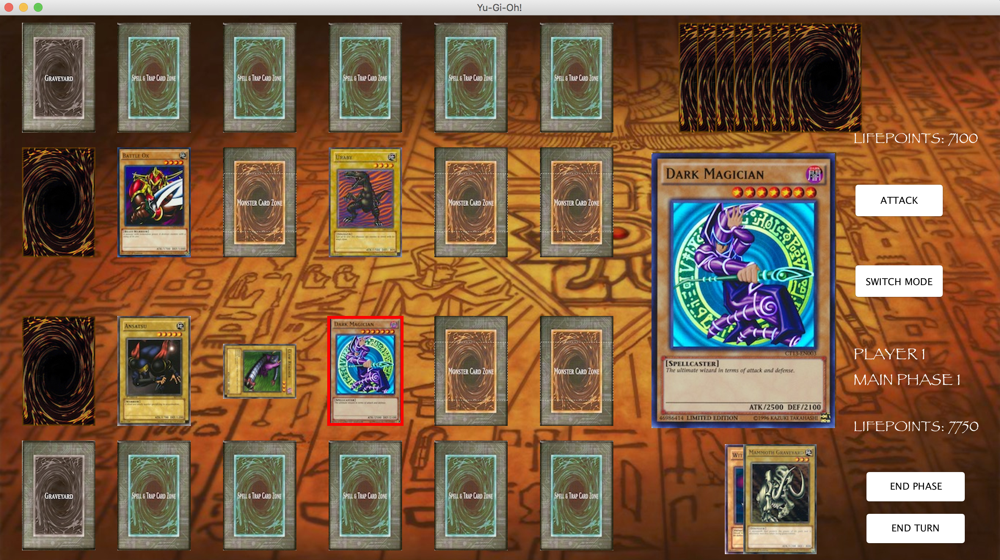

# yugioh

Java based game based on the Yu-Gi-Oh trading card game.



## Rules
Summoning Monsters
- To summon a monster, place the monster from your hand to the field.
- Only summon if there is a monster zone available on the field. Max of 5 monsters on the field for each player.
- You can only summon one monster to the field per turn.

Battling
- You can only attack with a monster during the battle phase.
- If your opponent controls no monsters, you can attack their lifepoints directly.
- Each monster can only declare an attack once per turn.

Battle position
- A monster can be in either Attack Position or Defense Position. 
- The position they are in determines which of their stats are used for damage calculation.
- Battle position can be changed once per turn for each monster during the Main Phase. 
- You cannot change its battle position if it was summoned, was set, or had attacked during that turn.

Damage calculation
- If both monsters are in Attack position, the one with less ATK is destroyed, and its controller takes damage equal to the difference.
- If they have equal ATK, both are destroyed.
- If one is in Defense position and it has less DEF than the attacking monster’s ATK, it is destroyed but its controller does not take damage.
- If it has more DEF, the attacking monster’s controller takes damage equal to the difference, and neither is destroyed
- If the ATK and DEF are equal, neither is destroyed.
- In a direct attack, the opponent takes the ATK of the monster as damage.

Dueling
1. Both players start the game with 8000 Life Points. The player going first cannot draw or attack.
2. Draw your starting hand. Both players draw 5 cards at the beginning of the game as their starting hand.
3. Draw a card. You draw a card from your deck at the beginning of your turn, during the Draw Phase. 
4. After the draw phase, you enter Main Phase 1. In this phase, monsters can be summoned, effects can be activated, a monster’s battle position can be manually changed, and spells and traps can be activated or set.
5. After main phase 1, you enter the Battle Phase. You can attack using Attack Position monsters you control during the Battle Phase. 
6. After the Battle Phase, you enter Main Phase 2. In this phase, the same actions as in Main Phase 1 can be performed, except you cannot change the battle position of a card that attacked during the Battle Phase. 
7. End your turn. After this, it becomes the next player’s turn.
8. Play until someone loses. Once a player’s Life Points reach zero, they lose the duel. 

### Installing

Download as a zip file or clone using the following command.

```
git clone https://github.com/yehray/yugioh.git
```

Use ant to run the build file to start the game.

```
ant run
```

## License

This project is licensed under the MIT License - see the [LICENSE.md](LICENSE.md) file for details


